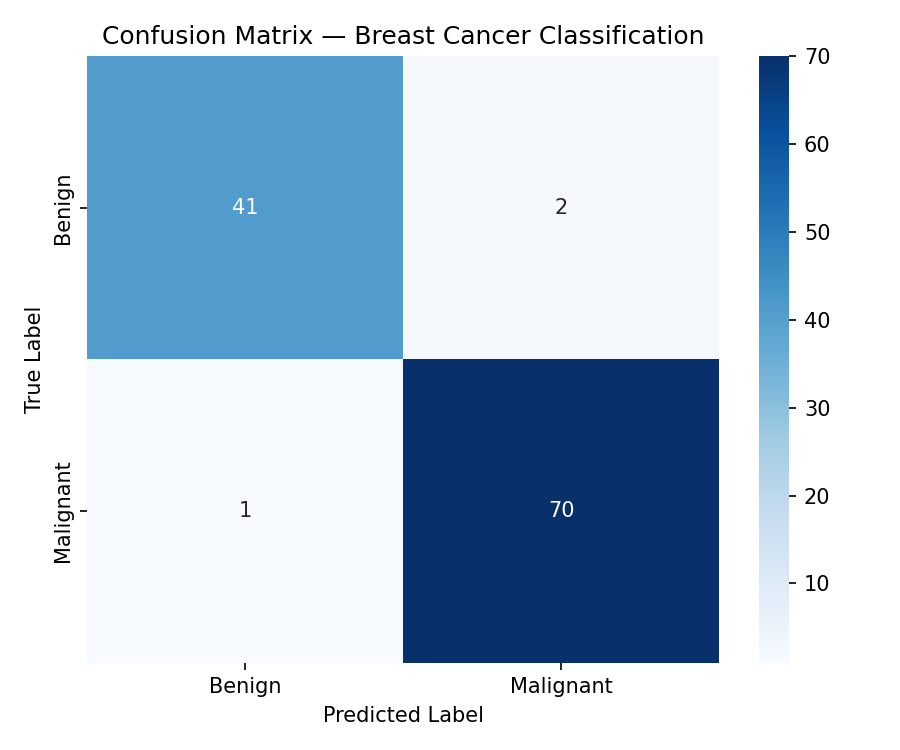
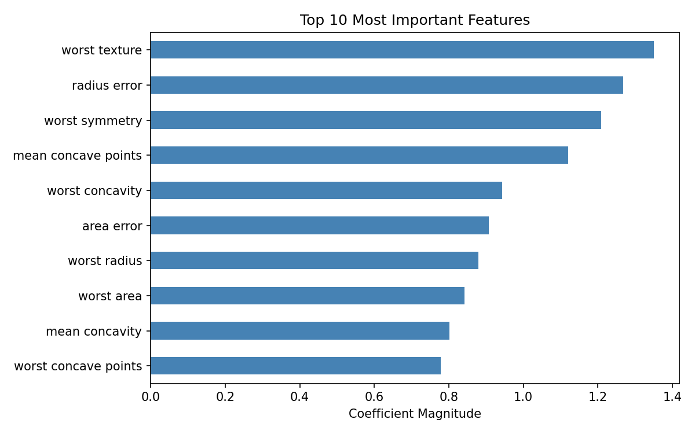

# 🔬 Breast Cancer Classification — Logistic Regression


A machine learning project that uses **Logistic Regression** to classify breast cancer tumours as **benign or malignant** using the Breast Cancer Wisconsin dataset from `sklearn`.

---

## 📌 Project Overview

| Item | Detail |
|---|---|
| **Dataset** | Breast Cancer Wisconsin (Diagnostic) |
| **Task** | Binary Classification |
| **Algorithm** | Logistic Regression |
| **Accuracy** | ~97% on test set |

---

## 📁 Project Structure

```
breast-cancer-logistic-regression/
├── src/
│   └── logistic_regression.py   # Main script
├── notebooks/
│   └── logistic_regression.ipynb  # Interactive notebook (Google Colab)
├── results/
│   ├── confusion_matrix.png     # Generated on first run
│   └── feature_importance.png   # Generated on first run
├── requirements.txt
├── .gitignore
└── README.md
```

---

## 🚀 Getting Started

### 1. Clone the repository
```bash
git clone https://github.com/YOUR_USERNAME/breast-cancer-logistic-regression.git
cd breast-cancer-logistic-regression
```

### 2. Create a virtual environment (recommended)
```bash
python -m venv venv
source venv/bin/activate        # macOS/Linux
venv\Scripts\activate           # Windows
```

### 3. Install dependencies
```bash
pip install -r requirements.txt
```

### 4. Run the script
```bash
python src/logistic_regression.py
```

---

## 📊 Results

### Confusion Matrix


### Feature Importance


---

## 🧠 How It Works

1. **Load** — The Breast Cancer Wisconsin dataset is loaded directly from `sklearn.datasets`
2. **Preprocess** — Features are split into train/test sets (80/20) and normalized with `StandardScaler`
3. **Train** — A `LogisticRegression` model is trained on the training set
4. **Evaluate** — Accuracy, Precision, Recall, F1-Score and a Confusion Matrix are computed
5. **Visualize** — Plots are saved to the `results/` folder

### Key Metrics Explained

| Metric | What it means |
|---|---|
| **Accuracy** | % of total correct predictions |
| **Precision** | Of all predicted positives, how many were actually positive |
| **Recall** | Of all actual positives, how many did the model catch |
| **F1 Score** | Harmonic mean of Precision and Recall — best for imbalanced classes |

---

## 📦 Dependencies

```
numpy
pandas
matplotlib
seaborn
scikit-learn
```

---

## 📄 License

This project is licensed under the [MIT License](LICENSE).

---

## 🙋 Author

Made with ❤️ as part of a Hands-On Machine Learning series.
Feel free to fork, star ⭐, and build on top of it!
